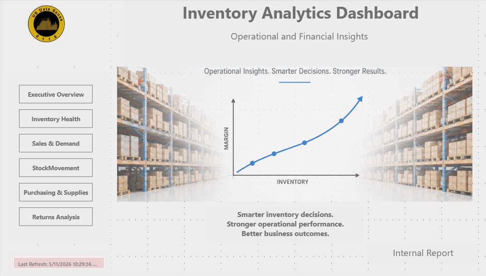
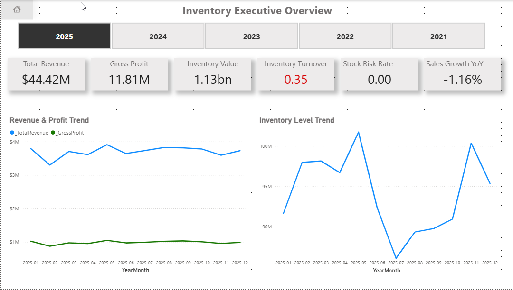
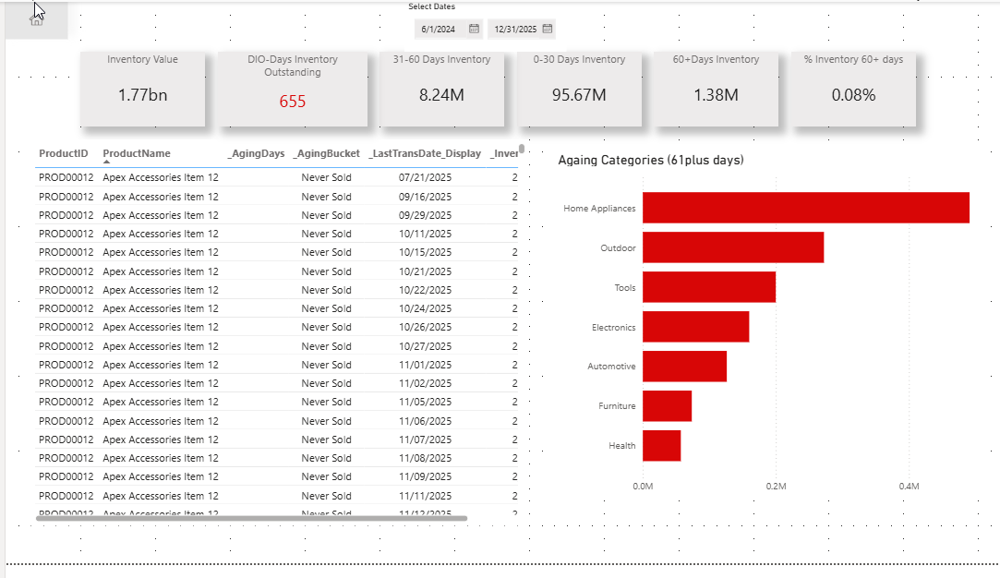
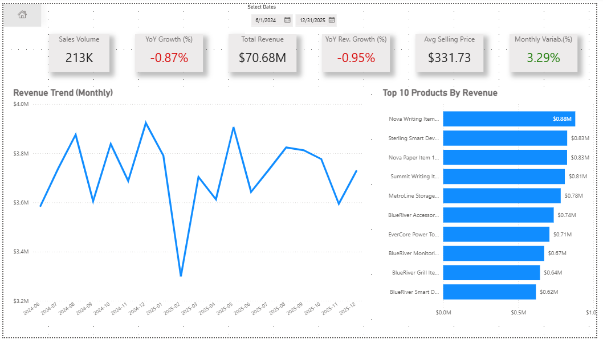
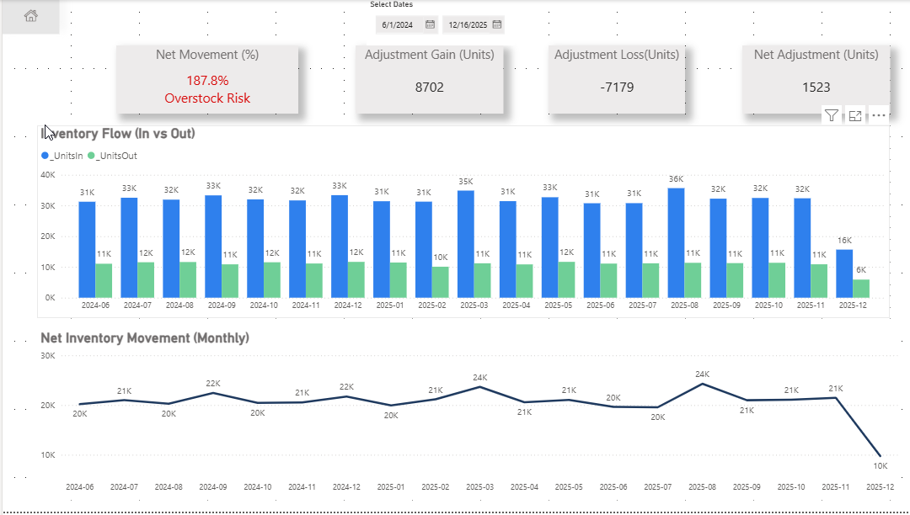
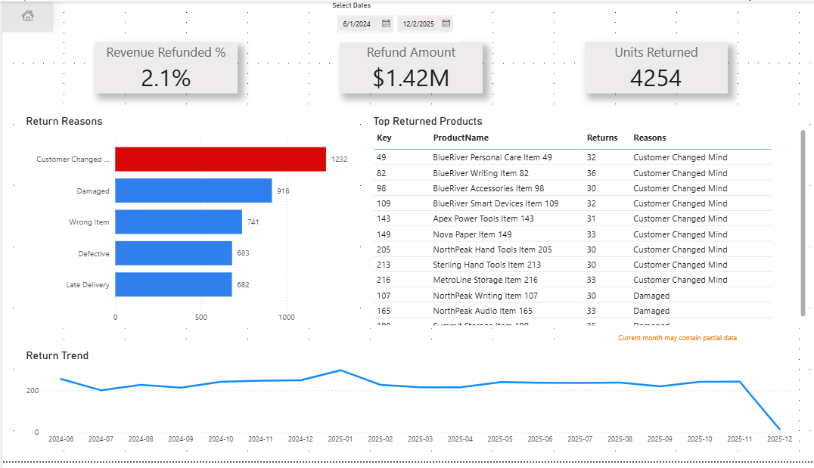

# 📦 Inventory Analytics Dashboard

Enterprise-style inventory and operational analytics solution designed to monitor inventory health, sales demand, stock movement, supplier performance, and returns analysis using Power BI and SQL Server.

# 🔗 Live Dashboard

👉 View Interactive Power BI Dashboard:
https://app.powerbi.com/view?r=eyJrIjoiOGNlYWNlZGEtMmZhOC00YTZkLWFmNjItNWRhODVhMmJlZWJlIiwidCI6IjQ2MWNiNDRiLWQ4MTEtNGEzYi05OWZmLWM4YTU3N2QzNDI1MiJ9

---

# 🚀 Project Overview

This project demonstrates a complete operational analytics reporting solution focused on inventory visibility, executive KPI reporting, purchasing performance, and returns analysis.

The dashboard was designed using a business-first approach with emphasis on:
- Executive reporting
- Operational visibility
- KPI-driven analytics
- Interactive navigation
- Clean enterprise-style dashboard design

---

# 📊 Dashboard Features

## Executive Overview
- Revenue and profitability KPIs
- Inventory value and turnover analysis
- Sales trend monitoring
- Operational performance visibility

## Inventory Health
- Inventory aging analysis
- Days Inventory Outstanding (DIO)
- Overstock and stock risk monitoring
- Inventory exposure tracking

## Sales & Demand
- Revenue trend analysis
- Sales volume tracking
- Demand variability insights
- Product and category performance

## Stock Movements
- Inventory inflow and outflow monitoring
- Net inventory movement analysis
- Adjustment and stock movement tracking
- Operational inventory flow visibility

## Purchasing & Supplier Performance
- Supplier lead time analysis
- On-time delivery tracking
- Purchase trends and supplier contribution
- Procurement performance monitoring

## Returns Analysis
- Revenue refunded analysis
- Return trend monitoring
- Return reason analysis
- Top returned products tracking

---

# 🛠️ Tools & Technologies

- Power BI
- DAX
- Power Query
- SQL Server

---

# 📸 Dashboard Preview

## Landing Page

## Executive Overview

## Inventory Health

## Sales & Demand

## Stock Movements

## Purchasing & Supplier Performance

## Returns Analysis

## Data Model

---

# 🧠 Skills Demonstrated

- Operational Analytics
- KPI Development
- Inventory Intelligence
- Executive Dashboard Design
- Data Modeling
- DAX & Time Intelligence
- Business Intelligence Reporting
- Interactive UX Design
- Data Visualization Best Practices

---

# 📬 About Me

Data professional focused on building scalable analytics solutions and executive reporting systems that transform operational data into actionable business insights.
